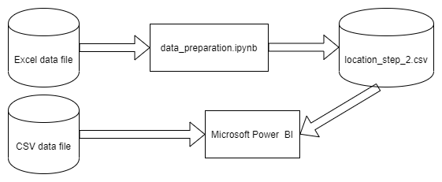
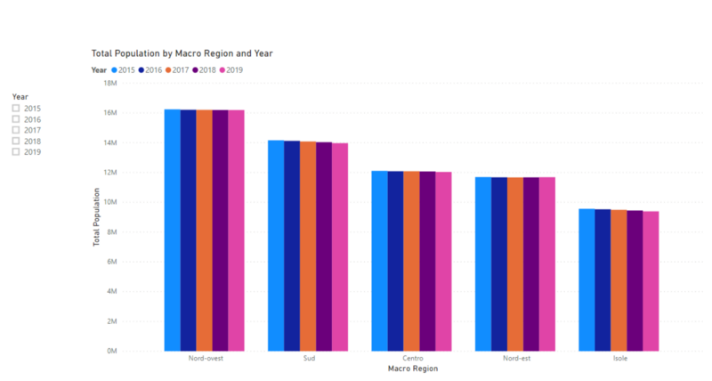
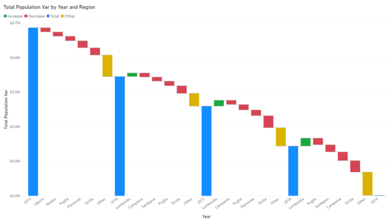

# Visualize ISTAT data

## Introduction

The goal is to get some insights about the regional distribution of population in Italy and how it is changed by year

## Software and Libraries

This project uses Python 3.8.2 for the data preparation

## Data

The dataset is provided by [ISTAT](http://dati.istat.it/?lang=en) is basically composed by:
* **ab69eff1-7aaa-4f13-9874-d07c9b7db9ad.xls**: location levels
* **DCIS_POPRES1_15032020152523718.csv**: population data by comune and year

## Running the code

The Jupyter Notebook `data_preparation.ipynb` contains all the steps needed to rebuild the location dimension: State - Geographic Area - Macro Region - Region - Province - Comune

Then [Microsoft Power BI](https://powerbi.microsoft.com/en-us/) `italy_population.pbix` has been used to visualize data

Flowchart made using [draw.io](https://about.draw.io/)

## Results

All visualization in the report are enabled to drill up/down on the location dimension

Italy has -0.53% people in 2019 compared to 2015 and the effect is more relevant on south and the islands

Lombardia is the only region with an increase of people in recent years

Results are better explained in this [blog post](https://medium.com/@simone.rigoni01/visualize-istat-data-with-microsoft-power-bi-faef3594c155)

## Licensing and Acknowledgements

Thank you [ISTAT](https://medium.com/r/?url=https%3A%2F%2Fwww.istat.it%2F) for the datasets and more information about the licensing of the data can be found on their web sites
